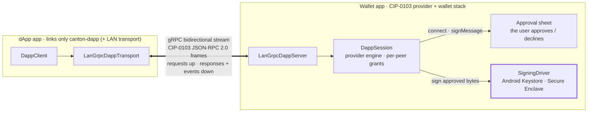

# canton-mobile-app

[](https://github.com/vsima/canton-mobile-app/actions/workflows/android.yml)
[](https://github.com/vsima/canton-mobile-app/actions/workflows/ios.yml)

Reference apps for the Canton Network — iOS (SwiftUI) and Android (Jetpack
Compose / Material 3) — built on
[canton-mobile-sdk](https://github.com/vsima/canton-mobile-sdk). They exist
to prove the native stack end-to-end with stock platform components:
everything the apps do goes through the SDK's public API.

**Two references, the two ends of CIP-0103:**

- **The wallet** (`android/wallet-app`, iOS `CantonWallet`) — links the wallet
  SDK stack: signing drivers, party onboarding, the token standard.
- **The dApp** (`android/dapp-app`, iOS `CantonDapp`) — a CIP-0103 client that
  links **only** `canton-dapp` (+ the LAN transport). It has no way to reach a
  signing driver or the Ledger API stubs, and the R8 release / simulator
  builds succeeding from that dependency set alone is the demonstration that
  the SDK's module split holds. This is where the ping, sign-in, and merchant
  examples land as they come online.

The dApp app is newer than the wallet — the cross-app transport, ping, and
sign-in flows are landing incrementally; see the SDK's dApp-connectivity work.

## Architecture — how a dApp and wallet connect

The dApp and the wallet are **separate apps**. They speak CIP-0103 (JSON-RPC
2.0, EIP-1193 semantics) over a transport. Today that transport is a gRPC
**bidirectional stream on the local network** — same Wi-Fi, no internet, no
relay: a dApp on the same device reaches the wallet over loopback, one on
another device over the LAN.



**The dApp is the client.** It holds a `DappClient` and makes typed calls
(`connect`, `listAccounts`, `signMessage`, …). It never sees a key — only the
signatures and results the wallet returns.

**The wallet is the server *and* the CIP-0103 provider.** A `LanGrpcDappServer`
accepts the stream and routes each frame into a `DappSession` built from the
wallet's own onboarded party. Anything that touches an account or a key raises
an **approval sheet** — the user decides — and signing happens in the device's
Keystore / Secure Enclave. Keys never cross the boundary.

The frames are identical whichever transport carries them. Swapping the LAN
stream for the in-process transport (the embed case) or a future WalletConnect
relay (to reach a wallet off-network) changes nothing above the transport —
same client, same engine, same approval and signing. That substitutability is
the point of keeping the protocol seam at the JSON-RPC frame.

A worked sign-in, end to end: the dApp calls `connect` (wallet approves,
shares the account) → builds a Sign-in-with-Canton challenge and calls
`signMessage` (wallet approves, signs the domain-separated bytes in the
enclave) → the dApp verifies the signature against the account's published
public key. No value moves; no key leaves the wallet.

## What the wallet demonstrates

- **Self-custody on device hardware.** External-party onboarding with keys
  generated in the Secure Enclave (iOS) or Android Keystore (StrongBox with
  TEE fallback), never leaving the device. The signer sheet reports the
  achieved security level honestly — including "software" in simulators.
- **Verify before signing.** Every externally-signed transaction goes
  through the SDK's client-side prepared-transaction hash verification: the
  hardware key only signs hashes the device has independently recomputed
  from the transaction itself.
- **CIP-0056 token standard.** Portfolio (holdings rolled up per
  instrument), the propose→accept inbox with on-device signed
  accept/reject, transfers with memos via registry choice contexts, and
  holdings history with transaction detail.
- **Transfer preapprovals as a product feature.** "Instant receiving" is a
  switch: on requests a receiver-signed preapproval (the validator
  automation accepts and pays); off exercises `TransferPreapproval_Cancel`,
  also signed on-device.
- **Cross-device payments.** The Send screen's QR scanner (VisionKit on
  iOS, Google code scanner on Android) reads another wallet's Receive code.
- **Adaptive layouts from stock components.** NavigationSplitView sidebar
  on iPad; `NavigationSuiteScaffold` bar→rail on Android phones, tablets,
  and foldables.
- **A CIP-0103 provider.** The "dApps" screen lets the wallet listen on the
  LAN; incoming connections and signature requests surface as approval
  sheets. (Wired for `connect` / `listAccounts` / `signMessage`; transaction
  submission follows the SDK's prepare pipeline.)

## What the dApp demonstrates

- **The module split, enforced by the build.** The dApp links only
  `canton-dapp` and the LAN transport. It *cannot* reach a signing driver or
  the Ledger API stubs — there is no import path — and its R8 release and iOS
  simulator builds succeeding from that dependency set alone is the proof, run
  on every CI build.
- **The custody boundary.** A dApp receives signatures and update ids, never a
  key and never a ledger token. Everything sensitive stays behind the wallet's
  approval sheet.
- **Transport-swap portability.** The same `DappClient` code runs over the LAN
  stream here; over the in-process transport when a B2B app embeds the wallet;
  over a relay if one is ever added. The app is written once against the
  standard API.
- **Sign in with Canton** (landing): prove control of a party by having the
  wallet sign a challenge, verified against the account's public key — the
  Canton analog of Sign-In with Ethereum, no value moved.

## Layout

Grouped by platform, so each toolchain builds both apps in one place:

- `android/` — one Gradle build with two application modules:
  `wallet-app` and `dapp-app`.
- `ios/` — one XcodeGen project (`project.yml`, generated and not committed)
  with two schemes: `CantonWallet` (sources in `Sources/Wallet`) and
  `CantonDapp` (`Sources/Dapp`).

The two apps deliberately share **no** module: the dApp's independence from
the wallet stack is the thing being shown, and a shared "common" module would
be the back door that quietly undoes it.

## SDK dependency

Both apps build against a **sibling checkout** of the SDK working tree, not
a published release:

```
<parent>/
├── canton-mobile-app/   (this repo)
└── canton-mobile-sdk/
```

- iOS: `ios/project.yml` references the SDK as a local Swift package at
  `../../canton-mobile-sdk`.
- Android: `android/settings.gradle.kts` uses a Gradle composite build
  (`includeBuild("../../canton-mobile-sdk/kotlin")`) that substitutes the
  `io.github.vsima.canton:*` coordinates with SDK source.

CI checks out both repos into the same sibling layout.

## Building

```sh
make ios       # xcodegen generate + simulator build, both schemes
make android   # assembleDebug + assembleRelease (R8), both modules
```

## Running against a live network

The apps expect a Splice LocalNet (the SDK's `integration/run-localnet.sh`
boots one). Simulators and emulators reach it directly; physical devices
use adb reverse tunnels:

```sh
adb reverse tcp:2901 tcp:2901   # ledger gRPC
adb reverse tcp:4000 tcp:4000   # scan / registry
adb reverse tcp:2000 tcp:2000   # validator API
```

then launch with the host override:
`adb shell am start -n io.github.vsima.canton.app/.MainActivity --es host 127.0.0.1`.
On Android emulators the app defaults to the `10.0.2.2` host bridge. The
SDK repo's faucet tool (`LocalNetFaucetTool`) seeds test balances and
pending offers.

## Connecting the dApp to the wallet

Both apps installed on one device (Android today; iOS provider follows):

1. **Wallet** → **dApps** tab → **Start listening**. Note the port.
2. **dApp app** → enter `127.0.0.1` and that port → **Connect**.
3. The wallet raises an approval sheet; approve, and the dApp lists the
   shared account.

Across two devices, use the wallet phone's Wi-Fi address instead of
`127.0.0.1`. No internet is involved either way — the session is a direct
gRPC stream on the local network.

## License

Apache-2.0 — see [LICENSE](LICENSE) and [NOTICE](NOTICE).
