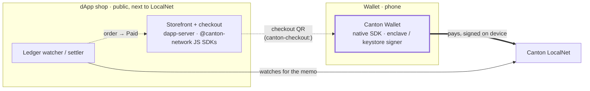

# canton-mobile-app

[](https://github.com/vsima/canton-mobile-app/actions/workflows/android.yml)
[](https://github.com/vsima/canton-mobile-app/actions/workflows/ios.yml)
[](https://github.com/vsima/canton-mobile-app/actions/workflows/dapp-server.yml)

**What.** Reference apps that show the [Canton mobile SDKs](https://github.com/vsima/canton-mobile-sdk)
in use, end to end, with stock platform components: an iOS (SwiftUI) and
Android (Jetpack Compose / Material 3) wallet, a Node/TypeScript dApp shop, and
a minimal dApp client.

**Why.** To show an integrator what real apps built on the SDKs look like, and
to keep the SDKs honest. **Everything here goes through the SDKs' public APIs** —
nothing reaches around them — and every flow is exercised on CI and
live-verified against a Splice LocalNet. If a capability works here, it works
through the API you'd use.

**Who.** Developers evaluating or integrating the Canton mobile SDKs — the
native [`canton-mobile-sdk`](https://github.com/vsima/canton-mobile-sdk)
(Swift + Kotlin) and the official `@canton-network` JavaScript SDKs — and
product people deciding what a wallet built on them can promise their
users. Every wallet feature below is written for both: what the user gets,
then what a developer can read and reuse, then where it has run for real.

## The three references

- **The wallet** — `android/wallet-app`, iOS `CantonWallet`. A self-custody
  wallet on the **native SDK**: device-held keys, external-party onboarding,
  the CIP-0056 token standard, and scan-to-pay. What a wallet built on the SDK
  looks like.
- **The dApp shop** — [`dapp-server/`](dapp-server/README.md). A Node/TS backend
  on the **official `@canton-network` JS SDKs**: a storefront that takes a
  payment and settles it on the ledger. The other side — a real dApp your wallet
  pays, built on the ecosystem's own code.
- **The dApp app** — `android/dapp-app`, iOS `CantonDapp`. A CIP-0103 client that
  links **only** `canton-dapp`. It has no import path to a signing driver or the
  Ledger API; its build succeeding from that dependency set alone is the SDK's
  module split, enforced on every CI run.

## How it fits together

The shop and the wallet are separate apps that never connect directly — **the
ledger is the link.** To buy something:

1. build a cart in the shop and check out;
2. **scan the checkout QR** with the wallet — the phone's camera opens it (a
   `canton-checkout:` deep link), or use the wallet's in-app scanner;
3. the wallet **reproduces the order for review**, prefilled, and the customer
   pays — signed on-device, submitted to the ledger via the SDK;
4. the shop's backend **watches the ledger** and marks the order paid the moment
   the transfer settles.



No relay, no server on the phone, no key ever leaving the device. The QR is a
self-describing payload, so the wallet prefills instantly — offline, with no
call back to the shop until the on-ledger payment itself. A direct CIP-0103
connection (WalletConnect one-tap) now ships alongside it, live-verified
end-to-end on both phones; the QR flow above stays the zero-relay, offline path.

## What the wallet does, and what it proves

Every feature is written three ways: **for users**, the outcome a product
manager can put on a roadmap; **for developers**, what it exercises in the
SDK and where to read the code; and **verified**, where it has run for
real. Everything goes through the SDKs' public APIs.

| Feature | What the user gets | Built on |
|---|---|---|
| Self-custody on device hardware | A key that cannot be exported, synced, or read, by anyone | `SigningDriver`, `ExternalPartyClient` |
| Verify before signing | The key signs only what the phone recomputed and showed | `signAndExecute` hash verification |
| Portfolio, inbox, transfers | Balances, offers to accept or reject, transfers with memos, history | `TokenStandardClient` |
| Instant receiving | A switch that makes incoming transfers settle in one step | Transfer preapproval APIs |
| Scan to pay | Point the camera at a shop's QR; the order is prefilled for review | `canton-checkout:` deep link |
| Connect a dApp or an agent | Pair by QR; sign-ins and payments come back to the phone for approval | `DappSession`, the WalletConnect adapter |
| Agents with limits | Per-dApp caps the wallet enforces, and an optional amount it approves alone | `DappSpendPolicy`, `SpendLedger` |
| Activity | One feed for money movement and everything an agent did, silent outcomes included | `DappActivity` |
| Pending requests | A request swiped away waits, with a countdown, until you decide or it expires | `DappRequestContext` |

### The wallet — native `canton-mobile-sdk`

#### Self-custody on device hardware

**For users.** The wallet's key is created inside the phone's secure
hardware (Secure Enclave on iOS, StrongBox or the TEE keystore on Android)
and never leaves it: not to a backup, not to a cloud, not to this app. The
signer screen says which tier the device achieved, including "software" in
a simulator.

**For developers.** External-party onboarding (generate, sign, allocate)
through `ExternalPartyClient` with a hardware `SigningDriver`. Read
`WalletModel` on either platform for onboarding and restore, and the signer
sheet for how the achieved level is reported.

**Verified.** Pixel 11 Pro (Android 17) with a StrongBox-resident key
ran the full agent payment flow, every signature in the secure element; a
TEE-tier OnePlus before it; the iPhone simulator with a software key,
reported as such.

#### Verify before signing

**For users.** Nothing is signed that the phone did not recompute itself:
the hardware key signs a hash the device derived from the transaction it
displayed.

**For developers.** `signAndExecute` verifies the prepared-transaction hash
by default and the app never opts out. Held to golden vectors shared by
both SDKs.

**Verified.** Every externally signed transaction in the flows below.

#### Portfolio, inbox, and transfers (CIP-0056)

**For users.** Balances rolled up per instrument, an inbox of transfers to
accept or reject, transfers with a memo, and a history with detail per
transaction.

**For developers.** `TokenStandardClient` end to end: holdings, the
propose-and-accept inbox with on-device signed accept and reject, transfers,
and history rows with direction, counterparty, and fee-inclusive net. Read
`WalletModel` and the Portfolio, Transfer, and Activity screens.

**Verified.** LocalNet, both platforms.

#### Instant receiving

**For users.** A switch. On, incoming transfers settle in one step with no
inbox. Off, they wait for acceptance again.

**For developers.** Transfer preapproval request, lookup, and cancel, all
signed on device; cancel is receiver-side and native-only.

**Verified.** LocalNet, both platforms.

#### Scan to pay

**For users.** Point the camera at a shop's checkout QR. The wallet opens
with the order prefilled for review; one tap pays. Nothing is fetched from
the shop until the payment itself.

**For developers.** A self-describing `canton-checkout:` deep link the
camera and the in-app scanner both open; no relay, no callback. The dApp
shop in `dapp-server/` produces it.

**Verified.** Both phones against the shop on LocalNet.

#### Connect a dApp or an agent

**For users.** Scan a pairing QR from a website or an AI agent. From then on
its sign-ins and payments arrive on the phone as typed approval screens
(Connect, Sign in, Payment) showing the amount, recipient, memo, a
countdown, and an "Unverified" mark when the origin is not attested.

**For developers.** The wallet side of CIP-0103 over WalletConnect: a Reown
WalletKit binding drives the SDK's adapter through two touch-points
(`sessionNamespaces` and `handle`), one `DappSession` per peer, decisions
through `DappApprovalDelegate`. Read `WalletConnect` (relay binding,
per-topic adapters, stable dApp identity) and the approval sheet in
`ConnectView` / `MainActivity`.

**Verified.** Pixel 11 Pro and the iOS simulator, with the reference
agent ([canton-agent-mcp](https://github.com/vsima/canton-agent-mcp)) and
the dApp shop.

#### Agents with limits

**For users.** Each connected dApp has its own limits: a per-payment
maximum, a rolling 24-hour cap, and optionally an amount under which
payments are approved without asking. Over a cap, the wallet refuses and
the agent is told why. Under the line, it pays silently. In between, you
decide. Limits stick to the dApp's identity, so re-pairing keeps them.

**For developers.** `DappSpendPolicy` supplied to the session per peer and
read on every request; receipts in a persisted `SpendLedger`; the strict
transfer parser `DappCommandSummary` behind the sheet's summary. Read
`AgentStore` (policies, receipts, and activity as JSON in app-private
storage, the same shapes on both platforms), the dApp detail sheet (the
editor), and the session factory in `WalletModel`.

**Verified.** Pixel and the iOS simulator: 1 CC paid silently, 5 CC on the
sheet, 100 CC refused with a visible row.

#### Activity

**For users.** One feed for money in and out, transfer offers, and
everything a dApp did: connected, signed in, requested, approved without
asking, refused, rate-limited, declined, paid, failed. Outcomes that never
showed a screen badge the tab and post a notification, so nothing an agent
did is invisible. Filters: All, Transfers, Requests, dApps.

**For developers.** `DappActivityObserver` on the session, persisted as JSON
lines and merged with `TokenStandardClient` history into one
reverse-chronological list. Read `ActivityView` / `ActivityScreen` and
`AgentNotifications`.

**Verified.** Both platforms.

#### Pending requests

**For users.** Swipe an approval away and it is not declined. It waits at
the top of Activity with a countdown to the dApp's own deadline, with
Decline and Approve on the row and Details to bring the screen back. Left
past the deadline, it is declined for you and the feed says so.

**For developers.** A queue in the model with one presented request; the
timer runs on `DappRequestContext.expiresAt` from the WalletConnect
envelope on iOS, and on the protocol's five-minute default on Android,
where Reown's WalletKit exposes no request expiry. A request that arrives
while another is up waits its turn, and a just-answered sheet is never
followed by the next one under the same finger. Read `pendingApprovals` in
`WalletModel` and the pending row in the Activity screen.

**Verified.** iOS simulator, live: swiped, reopened from the row, declined,
agent told "Declined". Android builds and passes its tests; not yet run on
a device.

#### Adaptive layouts from stock components

`NavigationSplitView` sidebar on iPad; `NavigationSuiteScaffold` bar to rail
on Android phones, tablets, and foldables.

### The dApp shop — official `@canton-network` JS SDKs

For a product, this is the other side of the counter: a real storefront that
takes a Canton payment from any wallet, with no key on the server. For a
developer, it is proof that the ecosystem's own JavaScript SDKs drive our
wallet.

- **Storefront, cart, checkout.** A browsable shop that turns a cart into one
  payable order priced in Canton Coin.
- **Ledger watch and settle.** The backend watches the ledger (`wallet-sdk`) and
  marks an order paid when the matching transfer lands — no key on the server.
- **Sign in with Canton.** Verifies a wallet controls a party by checking a
  signed challenge against its public key — the first external consumer of the
  SDK's `signMessage` domain-separation scheme.
- **Scan-to-pay payload.** A self-describing `canton-checkout://pay?…` QR the
  wallet reads inline.
- **WalletConnect one-tap.** The storefront also signs in and pays over a live
  WalletConnect session (CIP-0103): the wallet approves a connection, then the
  shop pushes a prepared payment (`prepareExecuteAndWait`) the wallet signs on
  device — live-verified end-to-end on both phones.

  *Proves: the **official ecosystem SDKs** drive a real dApp against our wallet —
  an independent implementation, not our own client talking to our own engine.*

### The dApp app — `canton-dapp` only

For a product, this is what a third-party app that asks a wallet for
signatures looks like when it holds nothing sensitive. For a developer, it
is the SDK's module split proven by a build.

- **The module split, enforced by the build.** Links only `canton-dapp`; it
  *cannot* reach a signing driver or the Ledger API stubs — there is no import
  path — and its R8 release and iOS simulator builds succeeding from that
  dependency set alone is the proof, run on every CI build.
- **The custody boundary.** A dApp receives signatures and update ids, never a
  key and never a ledger token.

## Setup

Two prerequisites: a **sibling checkout** of the SDK, and a running **LocalNet**.

**1. Sibling SDK checkout.** The apps build against the SDK working tree, not a
published release — clone it alongside this repo:

```
<parent>/
├── canton-mobile-app/   (this repo)
└── canton-mobile-sdk/   (git clone alongside it)
```

- iOS: `ios/project.yml` references the SDK as a local Swift package at
  `../../canton-mobile-sdk`.
- Android: `android/settings.gradle.kts` uses a Gradle composite build
  (`includeBuild("../../canton-mobile-sdk/kotlin")`) substituting the
  `io.github.vsima.canton:*` coordinates with SDK source.

CI checks out both repos into this layout.

**2. LocalNet.** The apps talk to a Splice LocalNet — boot one from the SDK repo:

```sh
cd ../canton-mobile-sdk && SPLICE_LOCALNET=1 integration/run-localnet.sh
```

The SDK's `LocalNetFaucetTool` seeds test balances and pending offers.

## Build, install, run

### The mobile apps — wallet + dApp app

```sh
make android   # assembleDebug + assembleRelease (R8), both modules
make ios       # xcodegen generate + simulator build, both schemes
```

Install the wallet on a device — always with `-r`. **Never uninstall it:** that
destroys the device key and, with it, the party.

```sh
adb install -r android/wallet-app/build/outputs/apk/debug/wallet-app-debug.apk
```

A physical device reaches LocalNet over adb reverse tunnels, then launches with
a host override (an emulator uses the `10.0.2.2` bridge automatically; the
override sticks across relaunches, including deep links):

```sh
adb reverse tcp:2901 tcp:2901   # ledger gRPC
adb reverse tcp:4000 tcp:4000   # scan / registry
adb reverse tcp:2000 tcp:2000   # validator API
adb shell am start -n io.github.vsima.canton.app/.MainActivity --es host 127.0.0.1
```

### The dApp shop — server

```sh
cd dapp-server
npm install
MERCHANT_PARTY=<a party with instant-receiving> PUBLIC_URL=http://<your-lan-ip>:8088 npm start
```

Open `http://localhost:8088`. Set `PUBLIC_URL` to a **LAN address** so the
checkout QR is reachable from a phone. See
[dapp-server/README.md](dapp-server/README.md) for the full configuration and
endpoints.

## Try it: scan to pay

1. Open the shop, add items to the cart, and **check out**.
2. **Scan the checkout QR** with your phone — the built-in camera opens the
   wallet (or use the wallet's Send scanner).
3. The wallet shows the order for **review**, prefilled; tap **Send**.
4. Watch the shop flip to **Paid** as the payment settles on-ledger.

## Try it: pay with an agent

1. Install the reference agent in Claude Code (other harnesses in
   [its README](https://github.com/vsima/canton-agent-mcp#install)):
   `claude mcp add canton-agent --env WC_PROJECT_ID=<your-project-id> -- npx -y canton-agent-mcp`.
2. Ask the agent to connect. It prints a QR; scan it from the wallet's
   **dApps** tab and tap **Connect**.
3. In **dApps**, tap the agent and set its limits: for example 10 per
   payment, 25 per day, approve alone under 2.
4. Ask the agent to pay **1 CC** to a party you know (the shop's merchant
   party works): it settles with no screen. Ask for **5 CC**: the approval
   screen appears. Ask for **100 CC**: the wallet refuses and the agent
   explains why.
5. Open **Activity**: every one of those is a row, including the two that
   showed nothing.

## Layout

Grouped by platform / runtime, so each toolchain builds its piece in one place:

- `android/` — one Gradle build with two application modules: `wallet-app` and
  `dapp-app`.
- `ios/` — one XcodeGen project (`project.yml`, generated and not committed) with
  two schemes: `CantonWallet` (`Sources/Wallet`) and `CantonDapp` (`Sources/Dapp`).
- `dapp-server/` — the Node/TS [dApp shop](dapp-server/README.md).

The mobile apps deliberately share **no** module: the dApp app's independence
from the wallet stack is the thing being shown, and a shared "common" module
would be the back door that quietly undoes it.

## License

Apache-2.0 — see [LICENSE](LICENSE) and [NOTICE](NOTICE).
