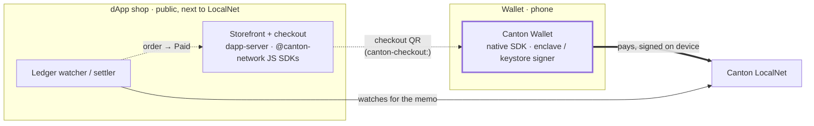

# canton-mobile-app

[](https://github.com/vsima/canton-mobile-app/actions/workflows/android.yml)
[](https://github.com/vsima/canton-mobile-app/actions/workflows/ios.yml)
[](https://github.com/vsima/canton-mobile-app/actions/workflows/dapp-server.yml)

**What.** Reference apps that show the [Canton mobile SDKs](https://github.com/vsima/canton-mobile-sdk)
in use, end to end, with stock platform components: an iOS (SwiftUI) and
Android (Jetpack Compose / Material 3) wallet, a Node/TypeScript dApp shop, and
a minimal dApp client.

**Why.** To show an integrator what real apps built on the SDKs look like, and
to keep the SDKs honest. **Everything here goes through the SDKs' public APIs** —
nothing reaches around them — and every flow is exercised on CI and
live-verified against a Splice LocalNet. If a capability works here, it works
through the API you'd use.

**Who.** Developers evaluating or integrating the Canton mobile SDKs — the
native [`canton-mobile-sdk`](https://github.com/vsima/canton-mobile-sdk)
(Swift + Kotlin) and the official `@canton-network` JavaScript SDKs.

## The three references

- **The wallet** — `android/wallet-app`, iOS `CantonWallet`. A self-custody
  wallet on the **native SDK**: device-held keys, external-party onboarding,
  the CIP-0056 token standard, and scan-to-pay. What a wallet built on the SDK
  looks like.
- **The dApp shop** — [`dapp-server/`](dapp-server/README.md). A Node/TS backend
  on the **official `@canton-network` JS SDKs**: a storefront that takes a
  payment and settles it on the ledger. The other side — a real dApp your wallet
  pays, built on the ecosystem's own code.
- **The dApp app** — `android/dapp-app`, iOS `CantonDapp`. A CIP-0103 client that
  links **only** `canton-dapp`. It has no import path to a signing driver or the
  Ledger API; its build succeeding from that dependency set alone is the SDK's
  module split, enforced on every CI run.

## How it fits together

The shop and the wallet are separate apps that never connect directly — **the
ledger is the link.** To buy something:

1. build a cart in the shop and check out;
2. **scan the checkout QR** with the wallet — the phone's camera opens it (a
   `canton-checkout:` deep link), or use the wallet's in-app scanner;
3. the wallet **reproduces the order for review**, prefilled, and the customer
   pays — signed on-device, submitted to the ledger via the SDK;
4. the shop's backend **watches the ledger** and marks the order paid the moment
   the transfer settles.



No relay, no server on the phone, no key ever leaving the device. The QR is a
self-describing payload, so the wallet prefills instantly — offline, with no
call back to the shop until the on-ledger payment itself. A direct CIP-0103
connection (WalletConnect-style one-tap) is the roadmap; today the ledger plus
the QR carry the flow.

## What's implemented — and what it proves for the SDK

### The wallet — native `canton-mobile-sdk`

- **Self-custody on device hardware.** External-party onboarding with keys in
  the Secure Enclave (iOS) or Android Keystore (StrongBox with TEE fallback),
  never leaving the device. The signer sheet reports the achieved security level
  honestly — including "software" in simulators. *Proves: `SigningDriver`,
  `ExternalPartyClient`.*
- **Verify before signing.** Every externally-signed transaction goes through
  the SDK's client-side prepared-transaction hash verification: the hardware key
  only signs a hash the device recomputed from the transaction itself. *Proves:
  `signAndExecute` hash verification, held to shared golden vectors.*
- **CIP-0056 token standard.** Portfolio (holdings rolled up per instrument),
  the propose→accept inbox with on-device signed accept/reject, transfers with
  memos, and holdings history with transaction detail. *Proves:
  `TokenStandardClient`, registry choice contexts.*
- **Transfer preapprovals.** "Instant receiving" is a switch: on requests a
  receiver-signed preapproval; off exercises `TransferPreapproval_Cancel`, also
  signed on-device. *Proves: the preapproval request / lookup / cancel APIs.*
- **Scan to pay.** The Send scanner — and the phone camera, via the
  `canton-checkout:` deep link — reads a shop's checkout QR, reproduces the
  order for review, and prefills the transfer. *Proves: the wallet as a real
  payer against a dApp.*
- **Adaptive layouts from stock components.** `NavigationSplitView` sidebar on
  iPad; `NavigationSuiteScaffold` bar→rail on Android phones, tablets, foldables.

### The dApp shop — official `@canton-network` JS SDKs

- **Storefront, cart, checkout.** A browsable shop that turns a cart into one
  payable order priced in Canton Coin.
- **Ledger watch and settle.** The backend watches the ledger (`wallet-sdk`) and
  marks an order paid when the matching transfer lands — no key on the server.
- **Sign in with Canton.** Verifies a wallet controls a party by checking a
  signed challenge against its public key — the first external consumer of the
  SDK's `signMessage` domain-separation scheme.
- **Scan-to-pay payload.** A self-describing `canton-checkout://pay?…` QR the
  wallet reads inline.

  *Proves: the **official ecosystem SDKs** drive a real dApp against our wallet —
  an independent implementation, not our own client talking to our own engine.*

### The dApp app — `canton-dapp` only

- **The module split, enforced by the build.** Links only `canton-dapp`; it
  *cannot* reach a signing driver or the Ledger API stubs — there is no import
  path — and its R8 release and iOS simulator builds succeeding from that
  dependency set alone is the proof, run on every CI build.
- **The custody boundary.** A dApp receives signatures and update ids, never a
  key and never a ledger token.

## Setup

Two prerequisites: a **sibling checkout** of the SDK, and a running **LocalNet**.

**1. Sibling SDK checkout.** The apps build against the SDK working tree, not a
published release — clone it alongside this repo:

```
<parent>/
├── canton-mobile-app/   (this repo)
└── canton-mobile-sdk/   (git clone alongside it)
```

- iOS: `ios/project.yml` references the SDK as a local Swift package at
  `../../canton-mobile-sdk`.
- Android: `android/settings.gradle.kts` uses a Gradle composite build
  (`includeBuild("../../canton-mobile-sdk/kotlin")`) substituting the
  `io.github.vsima.canton:*` coordinates with SDK source.

CI checks out both repos into this layout.

**2. LocalNet.** The apps talk to a Splice LocalNet — boot one from the SDK repo:

```sh
cd ../canton-mobile-sdk && SPLICE_LOCALNET=1 integration/run-localnet.sh
```

The SDK's `LocalNetFaucetTool` seeds test balances and pending offers.

## Build, install, run

### The mobile apps — wallet + dApp app

```sh
make android   # assembleDebug + assembleRelease (R8), both modules
make ios       # xcodegen generate + simulator build, both schemes
```

Install the wallet on a device — always with `-r`. **Never uninstall it:** that
destroys the device key and, with it, the party.

```sh
adb install -r android/wallet-app/build/outputs/apk/debug/wallet-app-debug.apk
```

A physical device reaches LocalNet over adb reverse tunnels, then launches with
a host override (an emulator uses the `10.0.2.2` bridge automatically; the
override sticks across relaunches, including deep links):

```sh
adb reverse tcp:2901 tcp:2901   # ledger gRPC
adb reverse tcp:4000 tcp:4000   # scan / registry
adb reverse tcp:2000 tcp:2000   # validator API
adb shell am start -n io.github.vsima.canton.app/.MainActivity --es host 127.0.0.1
```

### The dApp shop — server

```sh
cd dapp-server
npm install
MERCHANT_PARTY=<a party with instant-receiving> PUBLIC_URL=http://<your-lan-ip>:8088 npm start
```

Open `http://localhost:8088`. Set `PUBLIC_URL` to a **LAN address** so the
checkout QR is reachable from a phone. See
[dapp-server/README.md](dapp-server/README.md) for the full configuration and
endpoints.

## Try it: scan to pay

1. Open the shop, add items to the cart, and **check out**.
2. **Scan the checkout QR** with your phone — the built-in camera opens the
   wallet (or use the wallet's Send scanner).
3. The wallet shows the order for **review**, prefilled; tap **Send**.
4. Watch the shop flip to **Paid** as the payment settles on-ledger.

## Layout

Grouped by platform / runtime, so each toolchain builds its piece in one place:

- `android/` — one Gradle build with two application modules: `wallet-app` and
  `dapp-app`.
- `ios/` — one XcodeGen project (`project.yml`, generated and not committed) with
  two schemes: `CantonWallet` (`Sources/Wallet`) and `CantonDapp` (`Sources/Dapp`).
- `dapp-server/` — the Node/TS [dApp shop](dapp-server/README.md).

The mobile apps deliberately share **no** module: the dApp app's independence
from the wallet stack is the thing being shown, and a shared "common" module
would be the back door that quietly undoes it.

## License

Apache-2.0 — see [LICENSE](LICENSE) and [NOTICE](NOTICE).
